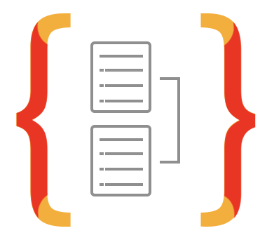

<h1> Olá, seja bem vinda(o) ao meu perfil do Github 😄❤️

Me chamo Thiago Ramos Gomes e sou um Desenvolvedor 💻                                                 

</h1>

 
 

## 📌 Linguagens, Frameworks/bibliotecas e aplicativos

<code>  </code>
<code>  </code>
<code>  </code>
<code>  </code>
<code>  </code>
<code>  </code>
<code>  </code>
<code>  </code>
<code>  </code>
<code>  </code>
<code>  </code>

 
 

## ✔️ Github status 

     
    

 
 

Se você gostou destes icones, eles são do autor <a href="https://www.freepik.com" title="Freepik">Freepik</a>, disponiveis no site <a href="https://www.flaticon.com/" title="Flaticon">www.flaticon.com</a>

